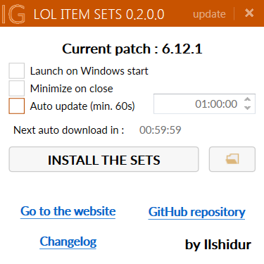

# LoL-item-sets

 

Download and automatically install the lastest LoL item sets from the website : lol-item-sets-generator.org (it will erase the previous item sets)

Mac version here : https://github.com/Ilshidur/LoL-item-sets-Mac

Preview :

Requires :

- The [.NET Framework 4.5](https://www.microsoft.com/en-US/download/details.aspx?id=30653) or higher

How to use
---------
- Download the [lastest version here](https://lol-item-sets-generator.org/clicks/click.php?id=dl_application_from_other_site)
- Run it as administrator

Dependencies
---------

- Windows Shell32
- [MahApps.Metro](http://mahapps.com/)

ChangeLog : [here](https://github.com/Ilshidur/LoL-item-sets/blob/master/CHANGELOG.md)
---------

TODO
---------

* Notify the user when a new version is available (and use ClickOnce)
* Better error messages
* Downloading : progressbar and "downloading ..." messages in a "Progress dialog" dialog.
* Add some Twitter ads (NON INTRUSIVE)
* Add a pop-up warning the user when a new patch came out

BACKERS
---------

* Jérôme P.

Thank you for donating !
